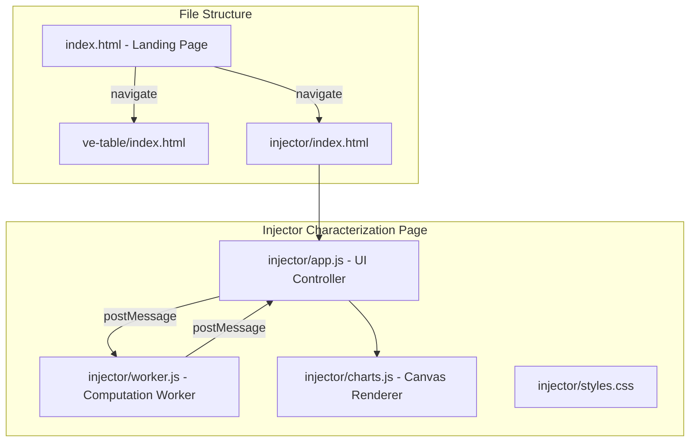
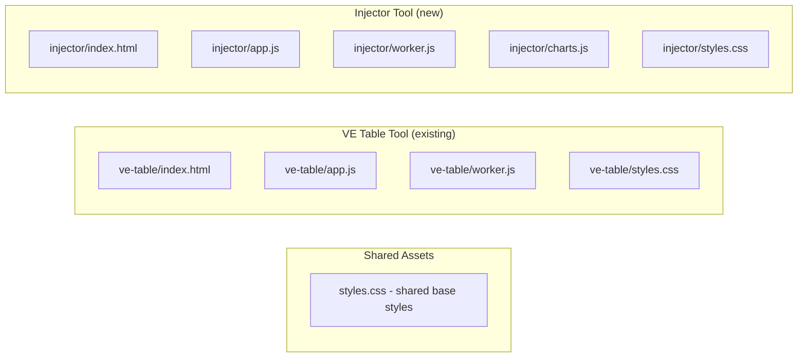
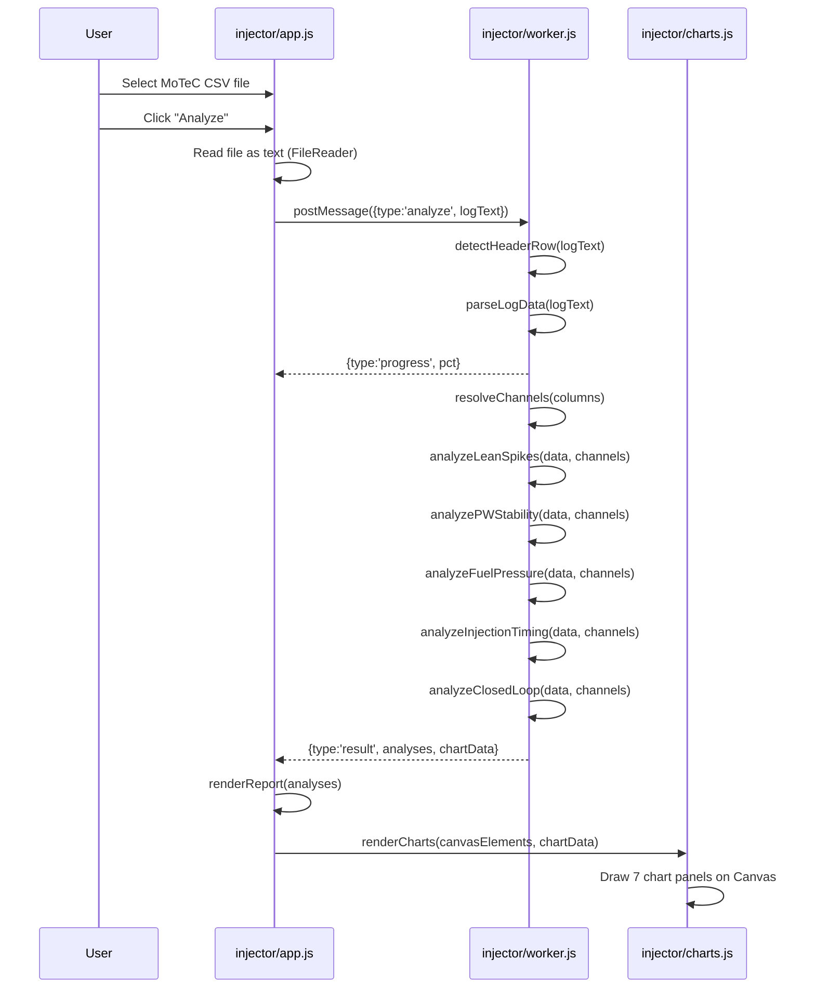
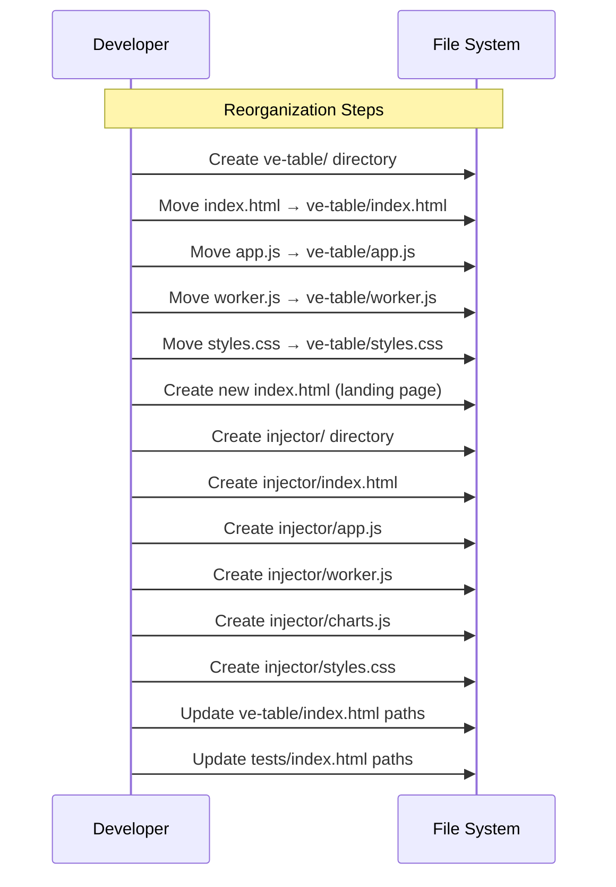

# Design Document: Injector Characterization

## Overview

This feature adds an "Injector Characterization" page to the TunerControl web app that replicates the functionality of the existing Python script `motec_injector_analysis.py` entirely in the browser. The script performs lean spike analysis, injector pulsewidth stability analysis, DI fuel pressure analysis, injection timing analysis, and closed-loop fuel trim analysis on MoTeC M1 CSV log data, producing both textual diagnostic reports and interactive charts.

Additionally, a new landing page is introduced to serve as the entry point for the application, providing navigation between the existing "VE Table Tuning" tool and the new "Injector Characterization" tool. The existing `index.html` is relocated to `ve-table/index.html`, and a new root `index.html` becomes the landing page.

The implementation maintains the project's zero-dependency, browser-only, file:// protocol architecture. Heavy computation runs in a dedicated Web Worker, and charts are rendered using the HTML5 Canvas API (no external charting library).

## Architecture





## Sequence Diagrams

### Main Analysis Flow



### File Structure Reorganization



## Components and Interfaces

### Component 1: Landing Page (index.html)

**Purpose**: Root entry point providing navigation to all analysis tools.

**Interface**: Static HTML page with card-based navigation links.

**Responsibilities**:
- Display application title and description
- Provide navigation cards linking to each tool
- Maintain consistent visual style with the rest of the app
- Work with file:// protocol (relative links only)

### Component 2: Injector Analysis UI Controller (injector/app.js)

**Purpose**: Manages the injector characterization page UI, file input, worker lifecycle, and result rendering.

**Interface**:
```javascript
// DOM event handlers
function handleFileSelect(event)       // File input change handler
function handleAnalyzeClick()          // Analyze button click handler

// Worker lifecycle
function createInjectorWorker()        // Creates Web Worker with Blob URL
function handleWorkerMessage(event)    // Dispatches worker messages

// Result rendering
function renderReport(analyses)        // Renders textual analysis report
function renderChartSection(chartData) // Sets up canvas elements and calls charts.js
```

**Responsibilities**:
- Validate file input (must be .csv)
- Read file contents via FileReader API
- Manage Web Worker creation/termination (Blob URL pattern for file:// compatibility)
- Display progress bar during parsing
- Render analysis results as structured HTML report sections
- Coordinate chart rendering

### Component 3: Injector Analysis Worker (injector/worker.js)

**Purpose**: Performs all heavy computation off the main thread — CSV parsing, channel resolution, and all five analysis modules.

**Interface**:
```javascript
// Inbound message
// { type: 'analyze', logText: string }

// Outbound messages
// { type: 'progress', rowsProcessed: number, totalRows: number }
// { type: 'warning', message: string }
// { type: 'error', message: string }
// { type: 'result', analyses: AnalysisResults, chartData: ChartData }
```

**Responsibilities**:
- Parse MoTeC M1 CSV format (auto-detect header row, skip metadata/units)
- Resolve channel names to column indices (case-insensitive matching)
- Execute five analysis modules and collect results
- Downsample data for chart rendering (max 150,000 points)
- Report progress during parsing
- Report warnings for missing optional channels
- Report errors for missing required channels

### Component 4: Chart Renderer (injector/charts.js)

**Purpose**: Renders the 7-panel analysis chart using HTML5 Canvas 2D API.

**Interface**:
```javascript
// Main entry point
function renderAllCharts(containers, chartData)

// Individual chart renderers
function renderLambdaTimeSeries(canvas, data)
function renderPWTimeSeries(canvas, data)
function renderLambdaVsPWScatter(canvas, data)
function renderFuelPressureTimeSeries(canvas, data)
function renderPWHistogram(canvas, data)
function renderLambdaRPMDensity(canvas, data)
function renderTimingVsRPMScatter(canvas, data)
```

**Responsibilities**:
- Render time-series plots with axes, gridlines, and threshold markers
- Render scatter plots with colour mapping
- Render histograms with bin counting
- Render 2D density heatmaps
- Handle canvas sizing and DPI scaling
- Provide legend and axis labels

## Data Models

### ChannelMap

```javascript
/**
 * Maps logical channel names to their MoTeC CSV column name candidates.
 * Each key maps to an array of possible column header strings.
 */
const CHANNEL_MAP = {
    time:             ["Time"],
    rpm:              ["Engine Speed"],
    map:              ["Inlet Manifold Pressure"],
    lambda_b1:        ["Exhaust Lambda Bank 1"],
    lambda_b2:        ["Exhaust Lambda Bank 2"],
    lambda_avg:       ["Exhaust Lambda"],
    inj_pw:           ["Fuel Cylinder 1 Primary Output Pulse Width 1"],
    inj_timing:       ["Fuel Cylinder 1 Primary Output Pulse Angle 1"],
    tps:              ["Throttle Position"],
    fuel_press_di:    ["Fuel Pressure Direct Bank 1"],
    fuel_press_di_aim:["Fuel Pressure Direct Bank 1 Aim"],
    coolant_temp:     ["Coolant Temperature"],
    iat:              ["Inlet Air Temperature"],
    cl_trim_b1:       ["Fuel Closed Loop Control Bank 1 Trim"],
    cl_trim_b2:       ["Fuel Closed Loop Control Bank 2 Trim"],
    fuel_mix_aim:     ["Fuel Mixture Aim"],
};
```

**Validation Rules**:
- `time` and `rpm` are required; analysis aborts if missing
- `lambda_b1` or `lambda_b2` or `lambda_avg` — at least one lambda source required
- All other channels are optional; missing channels skip their respective analysis section

### ResolvedChannels

```javascript
/**
 * @typedef {Object} ResolvedChannels
 * @property {number} timeIdx        - Column index for Time (-1 if missing)
 * @property {number} rpmIdx         - Column index for RPM (required)
 * @property {number} mapIdx         - Column index for MAP (-1 if missing)
 * @property {number} lambdaB1Idx    - Column index for Lambda Bank 1
 * @property {number} lambdaB2Idx    - Column index for Lambda Bank 2
 * @property {number} lambdaAvgIdx   - Column index for Lambda Average
 * @property {number} injPWIdx       - Column index for Injector Pulse Width
 * @property {number} injTimingIdx   - Column index for Injection Timing
 * @property {number} fuelPressDIIdx - Column index for DI Fuel Pressure
 * @property {number} fuelPressDIAimIdx - Column index for DI Fuel Pressure Aim
 * @property {number} clTrimB1Idx    - Column index for CL Trim Bank 1
 * @property {number} clTrimB2Idx    - Column index for CL Trim Bank 2
 * @property {string[]} warnings     - Non-fatal channel resolution warnings
 */
```

### AnalysisResults

```javascript
/**
 * @typedef {Object} AnalysisResults
 * @property {LeanSpikeResult} leanSpikes
 * @property {PWStabilityResult} pwStability
 * @property {FuelPressureResult} fuelPressure
 * @property {InjectionTimingResult} injectionTiming
 * @property {ClosedLoopResult} closedLoop
 * @property {string[]} channelWarnings
 * @property {Object} channelMapping - Which channels were resolved
 */

/**
 * @typedef {Object} LeanSpikeResult
 * @property {string} lambdaChannelUsed
 * @property {number} totalSamples
 * @property {number} leanEventCount
 * @property {number} leanEventPct
 * @property {number|null} bothBanksLean
 * @property {number|null} onlyB1Lean
 * @property {number|null} onlyB2Lean
 * @property {number|null} lowPWEvents
 * @property {number|null} leanWithLowPW
 * @property {number|null} leanWithLowPWPct
 * @property {Array<{band:string, spikes:number, total:number, pct:number}>} rpmDistribution
 * @property {string[]} diagnostics - Interpretive messages
 */

/**
 * @typedef {Object} PWStabilityResult
 * @property {string} channelUsed
 * @property {number} min
 * @property {number} max
 * @property {number} mean
 * @property {number} median
 * @property {number} stdDev
 * @property {number} pct5th
 * @property {number} pct1st
 * @property {number} belowThresholdCount
 * @property {number} belowThresholdPct
 * @property {string[]} diagnostics
 */

/**
 * @typedef {Object} FuelPressureResult
 * @property {string} channelUsed
 * @property {number} minBar
 * @property {number} maxBar
 * @property {number} meanBar
 * @property {number} stdBar
 * @property {number} below150BarCount
 * @property {number} below150BarPct
 * @property {number|null} meanErrorBar
 * @property {number|null} stdErrorBar
 * @property {number|null} largeErrorCount
 * @property {number|null} leanSpikeFPMeanBar
 * @property {number|null} overallFPMeanBar
 * @property {string[]} diagnostics
 */

/**
 * @typedef {Object} InjectionTimingResult
 * @property {string} channelUsed
 * @property {number} min
 * @property {number} max
 * @property {number} mean
 * @property {number} inOptimalCount
 * @property {number} inOptimalPct
 * @property {number} inCompressionCount
 * @property {number} inCompressionPct
 * @property {number|null} leanSpikeMeanTiming
 * @property {number|null} leanSpikeMedianTiming
 * @property {string[]} diagnostics
 */

/**
 * @typedef {Object} ClosedLoopResult
 * @property {{mean:number, std:number, min:number, max:number}|null} bank1
 * @property {{mean:number, std:number, min:number, max:number}|null} bank2
 * @property {string[]} diagnostics
 */
```

### ChartData

```javascript
/**
 * @typedef {Object} ChartData
 * @property {number[]} time           - Downsampled time array
 * @property {number[]} lambdaB1       - Lambda Bank 1 values (or null)
 * @property {number[]} lambdaB2       - Lambda Bank 2 values (or null)
 * @property {number[]} injPW          - Injector pulse width values
 * @property {number[]} fuelPressDI    - DI fuel pressure in bar
 * @property {number[]} fuelPressDIAim - DI fuel pressure aim in bar (or null)
 * @property {number[]} rpm            - RPM values
 * @property {number[]} injTiming      - Injection timing values
 * @property {number} downsampleStep   - Every Nth sample kept
 */
```

### Thresholds (Constants)

```javascript
const THRESHOLDS = {
    LEAN_SPIKE_LAMBDA: 1.06,    // Lambda above this = lean spike
    LOW_PW_MS: 0.8,             // Below this = XDI instability risk zone
    TARGET_LAMBDA: 1.0,         // Stoichiometric target
    IDLE_RPM_MAX: 1500,         // Max RPM considered idle
    LIGHT_LOAD_MAP_KPA: 60,     // kPa gauge for light load
    LOW_FUEL_PRESS_BAR: 150,    // Below this = significant pressure drop
    OPTIMAL_TIMING_START: 240,  // dBTDC - optimal injection window start
    OPTIMAL_TIMING_END: 320,    // dBTDC - optimal injection window end
    COMPRESSION_STROKE: 180,    // dBTDC - compression stroke boundary
    MAX_CHART_POINTS: 150000,   // Maximum points for chart rendering
};

const RPM_BINS = [0, 800, 1200, 1500, 2000, 2500, 3000, 4000, 5500, 7500];
const RPM_LABELS = ["<800","800-1.2k","1.2-1.5k","1.5-2k","2-2.5k","2.5-3k","3-4k","4-5.5k","5.5k+"];
```

## Algorithmic Pseudocode

### CSV Header Detection Algorithm

```javascript
/**
 * ALGORITHM detectHeaderRow
 * INPUT: lines (array of raw CSV lines)
 * OUTPUT: headerRowIndex (0-based row index where "Time" header is found)
 *
 * Preconditions:
 *   - lines is a non-empty array of strings
 *   - The file is a valid MoTeC M1 CSV export
 *
 * Postconditions:
 *   - Returns the 0-based index of the row whose first field is exactly "Time"
 *   - Throws if not found within first 25 lines
 */
function detectHeaderRow(lines) {
    const MAX_SCAN = 25;
    for (let i = 0; i < Math.min(MAX_SCAN, lines.length); i++) {
        const firstField = lines[i].split(',')[0].trim().replace(/^"|"$/g, '');
        if (firstField === 'Time') {
            return i;
        }
    }
    throw new Error('Could not find "Time" header row in first 25 lines.');
}
```

### Data Start Detection Algorithm

```javascript
/**
 * ALGORITHM findDataStart
 * INPUT: lines (array of CSV lines), headerRowIdx (index of header row)
 * OUTPUT: dataStartIdx (index of first numeric data row)
 *
 * Preconditions:
 *   - headerRowIdx is valid and within lines array bounds
 *   - Data rows have a numeric first field (the Time value)
 *
 * Postconditions:
 *   - Returns index of first row after header where first field parses as a number
 *   - Skips units row and any blank rows between header and data
 */
function findDataStart(lines, headerRowIdx) {
    for (let j = headerRowIdx + 1; j < Math.min(headerRowIdx + 6, lines.length); j++) {
        const firstField = lines[j].split(',')[0].trim().replace(/^"|"$/g, '');
        if (firstField !== '' && !isNaN(parseFloat(firstField))) {
            return j;
        }
    }
    return headerRowIdx + 2; // fallback: assume units row + 1 blank
}
```

### Channel Resolution Algorithm

```javascript
/**
 * ALGORITHM resolveInjectorChannels
 * INPUT: columnNames (string array of CSV column headers)
 * OUTPUT: ResolvedChannels object with indices and warnings
 *
 * Preconditions:
 *   - columnNames is a non-empty array of trimmed strings
 *
 * Postconditions:
 *   - All matched channels have valid 0-based indices
 *   - Unmatched channels have index -1
 *   - Throws if rpm is missing
 *   - Throws if no lambda source is available
 *   - Warnings array contains messages for missing optional channels
 *
 * Loop Invariant:
 *   - For each iteration i, nameToIdx contains all unique normalized
 *     column names from columnNames[0..i]
 */
function resolveInjectorChannels(columnNames) {
    // Build normalized lookup map
    const nameToIdx = new Map();
    for (let i = 0; i < columnNames.length; i++) {
        const normalized = columnNames[i].trim().toLowerCase();
        if (!nameToIdx.has(normalized)) {
            nameToIdx.set(normalized, i);
        }
    }

    const find = (candidates) => {
        for (const name of candidates) {
            const idx = nameToIdx.get(name.toLowerCase());
            if (idx !== undefined) return idx;
        }
        return -1;
    };

    // Resolve each channel from CHANNEL_MAP
    const resolved = {};
    const warnings = [];
    for (const [key, candidates] of Object.entries(CHANNEL_MAP)) {
        resolved[key] = find(candidates);
    }

    // Validate required channels
    if (resolved.rpm === -1) {
        throw new Error('Required channel "Engine Speed" not found');
    }
    const hasLambda = resolved.lambda_b1 !== -1 ||
                      resolved.lambda_b2 !== -1 ||
                      resolved.lambda_avg !== -1;
    if (!hasLambda) {
        throw new Error('No lambda channel found');
    }

    // Generate warnings for missing optional channels
    if (resolved.inj_pw === -1) warnings.push('Injector PW channel not found — PW analysis skipped');
    if (resolved.fuel_press_di === -1) warnings.push('DI fuel pressure not found — pressure analysis skipped');
    if (resolved.inj_timing === -1) warnings.push('Injection timing not found — timing analysis skipped');

    return { ...resolved, warnings };
}
```

### Lean Spike Analysis Algorithm

```javascript
/**
 * ALGORITHM analyzeLeanSpikes
 * INPUT: data (parsed numeric arrays), channels (resolved indices), thresholds
 * OUTPUT: LeanSpikeResult
 *
 * Preconditions:
 *   - data contains at least one lambda source with valid numeric values
 *   - RPM data is available for distribution analysis
 *
 * Postconditions:
 *   - leanEventCount = count of samples where lambda > LEAN_SPIKE_LAMBDA
 *   - rpmDistribution bins sum to leanEventCount
 *   - If both banks available: bothBanksLean + onlyB1Lean + onlyB2Lean = total lean events
 *   - diagnostics contains interpretive messages based on patterns found
 *
 * Loop Invariant:
 *   - After processing sample i: leanCount = number of lean events in data[0..i]
 */
function analyzeLeanSpikes(data, channels) {
    const lambdaCol = channels.lambda_b1 !== -1 ? 'lambda_b1'
                    : channels.lambda_avg !== -1 ? 'lambda_avg' : null;
    if (!lambdaCol) return null;

    let leanCount = 0;
    let bothBanksLean = 0, onlyB1 = 0, onlyB2 = 0;
    let lowPWEvents = 0, leanWithLowPW = 0;
    const rpmBins = new Array(RPM_LABELS.length).fill(0);
    const rpmTotals = new Array(RPM_LABELS.length).fill(0);

    for (let i = 0; i < data.length; i++) {
        const lambda = data[i][channels[lambdaCol]];
        const rpm = data[i][channels.rpm];
        const isLean = lambda > THRESHOLDS.LEAN_SPIKE_LAMBDA;

        // RPM bin assignment
        const binIdx = assignRPMBin(rpm);
        if (binIdx >= 0) rpmTotals[binIdx]++;

        if (isLean) {
            leanCount++;
            if (binIdx >= 0) rpmBins[binIdx]++;

            // Bank comparison (if both available)
            if (channels.lambda_b1 !== -1 && channels.lambda_b2 !== -1) {
                const b1Lean = data[i][channels.lambda_b1] > THRESHOLDS.LEAN_SPIKE_LAMBDA;
                const b2Lean = data[i][channels.lambda_b2] > THRESHOLDS.LEAN_SPIKE_LAMBDA;
                if (b1Lean && b2Lean) bothBanksLean++;
                else if (b1Lean) onlyB1++;
                else if (b2Lean) onlyB2++;
            }

            // Low PW correlation
            if (channels.inj_pw !== -1) {
                const pw = data[i][channels.inj_pw];
                if (pw < THRESHOLDS.LOW_PW_MS) leanWithLowPW++;
            }
        }

        if (channels.inj_pw !== -1 && data[i][channels.inj_pw] < THRESHOLDS.LOW_PW_MS) {
            lowPWEvents++;
        }
    }

    return buildLeanSpikeResult(leanCount, data.length, bothBanksLean,
        onlyB1, onlyB2, lowPWEvents, leanWithLowPW, rpmBins, rpmTotals);
}
```

### Pulsewidth Stability Analysis Algorithm

```javascript
/**
 * ALGORITHM analyzePWStability
 * INPUT: data (parsed numeric arrays), channels (resolved indices)
 * OUTPUT: PWStabilityResult
 *
 * Preconditions:
 *   - channels.inj_pw !== -1 (PW channel is available)
 *   - Data contains numeric PW values
 *
 * Postconditions:
 *   - Statistics computed only on samples where PW > 0.05 (excludes off events)
 *   - pct5th and pct1st are accurate percentile values
 *   - diagnostics reflect threshold comparisons per XDI injector specs
 *
 * Loop Invariant:
 *   - validPW array contains all PW values > 0.05 from data[0..i]
 */
function analyzePWStability(data, channels) {
    if (channels.inj_pw === -1) return null;

    const validPW = [];
    for (let i = 0; i < data.length; i++) {
        const pw = data[i][channels.inj_pw];
        if (!isNaN(pw) && pw > 0.05) {
            validPW.push(pw);
        }
    }

    if (validPW.length === 0) return null;

    validPW.sort((a, b) => a - b);

    const stats = {
        min: validPW[0],
        max: validPW[validPW.length - 1],
        mean: computeMean(validPW),
        median: computeMedian(validPW),
        stdDev: computeStdDev(validPW),
        pct5th: computePercentile(validPW, 0.05),
        pct1st: computePercentile(validPW, 0.01),
        belowThresholdCount: countBelow(validPW, THRESHOLDS.LOW_PW_MS),
    };

    stats.belowThresholdPct = (stats.belowThresholdCount / validPW.length) * 100;
    stats.diagnostics = generatePWDiagnostics(stats);

    return stats;
}
```

### Fuel Pressure Analysis Algorithm

```javascript
/**
 * ALGORITHM analyzeFuelPressure
 * INPUT: data (parsed numeric arrays), channels (resolved indices)
 * OUTPUT: FuelPressureResult
 *
 * Preconditions:
 *   - channels.fuel_press_di !== -1
 *   - MoTeC logs DI pressure in dMPa (multiply by 100 for bar)
 *
 * Postconditions:
 *   - All pressure values reported in bar (dMPa * 100)
 *   - Error vs aim computed only if fuel_press_di_aim channel exists
 *   - Lean spike correlation computed only if lambda channel exists
 */
function analyzeFuelPressure(data, channels) {
    if (channels.fuel_press_di === -1) return null;

    const pressures = [];  // in bar
    const errors = [];     // actual - aim, in bar
    let below150Count = 0;
    let leanSpikePressureSum = 0, leanSpikeCount = 0;

    const lambdaCol = channels.lambda_b1 !== -1 ? channels.lambda_b1
                    : channels.lambda_avg !== -1 ? channels.lambda_avg : -1;

    for (let i = 0; i < data.length; i++) {
        const pressBar = data[i][channels.fuel_press_di] * 100;
        if (isNaN(pressBar)) continue;

        pressures.push(pressBar);
        if (pressBar < THRESHOLDS.LOW_FUEL_PRESS_BAR) below150Count++;

        // Pressure error vs aim
        if (channels.fuel_press_di_aim !== -1) {
            const aimBar = data[i][channels.fuel_press_di_aim] * 100;
            if (!isNaN(aimBar)) errors.push(pressBar - aimBar);
        }

        // Lean spike correlation
        if (lambdaCol !== -1) {
            const lambda = data[i][lambdaCol];
            if (lambda > THRESHOLDS.LEAN_SPIKE_LAMBDA) {
                leanSpikePressureSum += pressBar;
                leanSpikeCount++;
            }
        }
    }

    return buildFuelPressureResult(pressures, errors, below150Count,
        leanSpikePressureSum, leanSpikeCount);
}
```

### Injection Timing Analysis Algorithm

```javascript
/**
 * ALGORITHM analyzeInjectionTiming
 * INPUT: data (parsed numeric arrays), channels (resolved indices)
 * OUTPUT: InjectionTimingResult
 *
 * Preconditions:
 *   - channels.inj_timing !== -1
 *   - Timing values are in dBTDC (degrees Before Top Dead Centre compression)
 *
 * Postconditions:
 *   - inOptimalCount = samples where timing is in [240, 320] dBTDC
 *   - inCompressionCount = samples where timing < 180 dBTDC
 *   - Lean spike timing stats computed only if lambda channel available
 */
function analyzeInjectionTiming(data, channels) {
    if (channels.inj_timing === -1) return null;

    const timingValues = [];
    let inOptimal = 0, inCompression = 0;
    const leanTimings = [];

    const lambdaCol = channels.lambda_b1 !== -1 ? channels.lambda_b1
                    : channels.lambda_avg !== -1 ? channels.lambda_avg : -1;

    for (let i = 0; i < data.length; i++) {
        const timing = data[i][channels.inj_timing];
        if (isNaN(timing)) continue;

        timingValues.push(timing);

        if (timing >= THRESHOLDS.OPTIMAL_TIMING_START &&
            timing <= THRESHOLDS.OPTIMAL_TIMING_END) {
            inOptimal++;
        }
        if (timing < THRESHOLDS.COMPRESSION_STROKE) {
            inCompression++;
        }

        // Lean spike timing correlation
        if (lambdaCol !== -1) {
            const lambda = data[i][lambdaCol];
            if (lambda > THRESHOLDS.LEAN_SPIKE_LAMBDA) {
                leanTimings.push(timing);
            }
        }
    }

    return buildTimingResult(timingValues, inOptimal, inCompression, leanTimings);
}
```

### Closed Loop Trim Analysis Algorithm

```javascript
/**
 * ALGORITHM analyzeClosedLoop
 * INPUT: data (parsed numeric arrays), channels (resolved indices)
 * OUTPUT: ClosedLoopResult
 *
 * Preconditions:
 *   - At least one of cl_trim_b1 or cl_trim_b2 is available
 *
 * Postconditions:
 *   - For each available bank: mean, std, min, max computed
 *   - diagnostics generated if |mean| > 5% or std > 4%
 */
function analyzeClosedLoop(data, channels) {
    const result = { bank1: null, bank2: null, diagnostics: [] };

    for (const [bankLabel, chKey] of [['Bank 1', 'cl_trim_b1'], ['Bank 2', 'cl_trim_b2']]) {
        if (channels[chKey] === -1) continue;

        const values = [];
        for (let i = 0; i < data.length; i++) {
            const v = data[i][channels[chKey]];
            if (!isNaN(v)) values.push(v);
        }

        if (values.length === 0) continue;

        const stats = {
            mean: computeMean(values),
            std: computeStdDev(values),
            min: Math.min(...values),
            max: Math.max(...values),
        };

        if (bankLabel === 'Bank 1') result.bank1 = stats;
        else result.bank2 = stats;

        // Diagnostics
        if (Math.abs(stats.mean) > 5) {
            const direction = stats.mean < 0 ? 'rich' : 'lean';
            result.diagnostics.push(
                `${bankLabel} mean trim of ${stats.mean.toFixed(1)}% suggests base VE is ${direction}`
            );
        }
        if (stats.std > 4) {
            result.diagnostics.push(
                `${bankLabel} trim std dev ${stats.std.toFixed(1)}% is high — inconsistent fueling`
            );
        }
    }

    return result;
}
```

## Key Functions with Formal Specifications

### Function: detectHeaderRow()

```javascript
function detectHeaderRow(lines)
```

**Preconditions:**
- `lines` is a non-empty array of strings
- Each string represents one line from the CSV file

**Postconditions:**
- Returns a non-negative integer representing the 0-based row index
- The returned row's first comma-separated field, after trimming and quote removal, equals "Time"
- Throws Error if no such row exists in lines[0..24]

**Loop Invariants:** N/A (simple linear scan with early return)

---

### Function: resolveInjectorChannels()

```javascript
function resolveInjectorChannels(columnNames)
```

**Preconditions:**
- `columnNames` is a non-empty array of strings
- Strings may contain leading/trailing whitespace and quotes

**Postconditions:**
- Returns object with integer indices for each channel key
- Index is -1 for channels not found in columnNames
- Matching is case-insensitive after trimming
- Throws if "Engine Speed" (rpm) is not found
- Throws if no lambda source is found (all three lambda channels missing)
- warnings array is populated for missing optional channels

**Loop Invariants:**
- nameToIdx map contains entries for all unique normalized names from columnNames[0..i]

---

### Function: computeMean()

```javascript
function computeMean(sortedArray)
```

**Preconditions:**
- `sortedArray` is a non-empty array of finite numbers

**Postconditions:**
- Returns the arithmetic mean: sum(array) / array.length
- Result is a finite number (no NaN, no Infinity)

---

### Function: computePercentile()

```javascript
function computePercentile(sortedArray, p)
```

**Preconditions:**
- `sortedArray` is sorted in ascending order
- `sortedArray.length > 0`
- `0 <= p <= 1`

**Postconditions:**
- Returns the value at position `p * (n - 1)` using linear interpolation
- Result is within [sortedArray[0], sortedArray[n-1]]

---

### Function: computeStdDev()

```javascript
function computeStdDev(values)
```

**Preconditions:**
- `values` is a non-empty array of finite numbers

**Postconditions:**
- Returns population standard deviation: sqrt(sum((x - mean)^2) / n)
- Result is non-negative

---

### Function: assignRPMBin()

```javascript
function assignRPMBin(rpm)
```

**Preconditions:**
- `rpm` is a number (may be NaN)

**Postconditions:**
- Returns index into RPM_LABELS array (0 to 8)
- Returns -1 if rpm is NaN or outside all bins
- Bin assignment uses RPM_BINS boundaries: value falls in bin i if RPM_BINS[i] < rpm <= RPM_BINS[i+1]

---

### Function: downsampleForCharts()

```javascript
function downsampleForCharts(data, channels, maxPoints)
```

**Preconditions:**
- `data` is the full parsed data array
- `maxPoints` > 0

**Postconditions:**
- Returns ChartData object with arrays of length <= maxPoints
- downsampleStep = max(1, floor(data.length / maxPoints))
- Every Nth sample is included (uniform downsampling)
- Pressure values converted from dMPa to bar in output

## Example Usage

```javascript
// === Landing Page Navigation (index.html) ===
// Simple card-based navigation — no JavaScript required
// <a href="ve-table/index.html"> and <a href="injector/index.html">

// === Injector Analysis Page (injector/app.js) ===

// 1. User selects a MoTeC CSV file
const fileInput = document.getElementById('log-input');
fileInput.addEventListener('change', () => {
    const file = fileInput.files[0];
    if (file && file.name.toLowerCase().endsWith('.csv')) {
        analyzeBtn.disabled = false;
    }
});

// 2. User clicks Analyze — read file and post to worker
analyzeBtn.addEventListener('click', async () => {
    const text = await readFileAsText(selectedFile);
    const worker = createInjectorWorker();
    worker.postMessage({ type: 'analyze', logText: text });

    worker.onmessage = (e) => {
        switch (e.data.type) {
            case 'progress':
                updateProgress(e.data.rowsProcessed, e.data.totalRows);
                break;
            case 'result':
                renderReport(e.data.analyses);
                renderAllCharts(canvasContainers, e.data.chartData);
                break;
            case 'error':
                showError(e.data.message);
                break;
        }
    };
});

// === Worker (injector/worker.js) ===

self.onmessage = function(e) {
    if (e.data.type !== 'analyze') return;

    const lines = e.data.logText.split('\n');
    const headerRow = detectHeaderRow(lines);
    const dataStart = findDataStart(lines, headerRow);
    const columnNames = lines[headerRow].split(',').map(s => s.trim().replace(/^"|"$/g, ''));
    const channels = resolveInjectorChannels(columnNames);

    // Parse data rows into numeric arrays
    const data = parseDataRows(lines, dataStart, columnNames.length, (processed, total) => {
        self.postMessage({ type: 'progress', rowsProcessed: processed, totalRows: total });
    });

    // Run all analyses
    const analyses = {
        leanSpikes: analyzeLeanSpikes(data, channels),
        pwStability: analyzePWStability(data, channels),
        fuelPressure: analyzeFuelPressure(data, channels),
        injectionTiming: analyzeInjectionTiming(data, channels),
        closedLoop: analyzeClosedLoop(data, channels),
        channelWarnings: channels.warnings,
    };

    // Downsample for charts
    const chartData = downsampleForCharts(data, channels, THRESHOLDS.MAX_CHART_POINTS);

    self.postMessage({ type: 'result', analyses, chartData });
};
```

## Correctness Properties

*A property is a characteristic or behavior that should hold true across all valid executions of a system — essentially, a formal statement about what the system should do. Properties serve as the bridge between human-readable specifications and machine-verifiable correctness guarantees.*

### Property 1: File Extension Validation

*For any* filename string, the UI_Controller SHALL enable the Analyze button if and only if the filename ends with ".csv" (case-insensitive). For any filename not ending in ".csv", the button SHALL remain disabled.

**Validates: Requirements 3.1, 3.2**

### Property 2: Header Row Detection

*For any* text input where one of the first 25 lines has "Time" as its first comma-separated field (after trimming and quote removal), `detectHeaderRow` SHALL return the 0-based index of that line. For any text where no such line exists in the first 25 lines, it SHALL throw an error.

**Validates: Requirements 4.1, 4.2**

### Property 3: Data Start Detection

*For any* valid MoTeC CSV structure with a known header row index, `findDataStart` SHALL return the index of the first row after the header whose first field parses as a finite number, correctly skipping units and blank rows.

**Validates: Requirement 4.3**

### Property 4: Numeric Parsing Correctness

*For any* string value in a data row, the parser SHALL produce the equivalent finite number if the string is a valid numeric representation, or NaN otherwise. No valid numeric string shall become NaN, and no non-numeric string shall become a finite number.

**Validates: Requirement 4.4**

### Property 5: Channel Resolution Case-Insensitivity and Completeness

*For any* array of column header strings, the Channel_Resolver SHALL match candidates regardless of letter case. For any set of column headers containing required channels in any case variation, the resolver SHALL return valid indices. For any missing optional channel, the resolver SHALL produce a warning without throwing.

**Validates: Requirements 5.1, 5.4**

### Property 6: Progress Monotonicity

*For any* sequence of progress messages emitted during CSV parsing, `rowsProcessed` values SHALL be strictly increasing, and every `rowsProcessed` value SHALL be less than or equal to `totalRows`.

**Validates: Requirements 6.2, 6.3**

### Property 7: Lean Spike Count Accuracy

*For any* dataset with lambda values, the reported `leanEventCount` SHALL equal the exact count of samples where the lambda value strictly exceeds 1.06.

**Validates: Requirement 7.1**

### Property 8: Bank Categorization Partition

*For any* dataset with both Bank 1 and Bank 2 lambda channels, every lean spike event SHALL be categorized into exactly one of: both-banks-lean, only-Bank-1-lean, or only-Bank-2-lean. The sum `bothBanksLean + onlyB1Lean + onlyB2Lean` SHALL equal `leanEventCount`.

**Validates: Requirements 7.2, 7.3**

### Property 9: RPM Bin Distribution Completeness

*For any* dataset, every lean spike event with a valid (non-NaN) RPM value SHALL be assigned to exactly one RPM bin. The sum of all RPM bin counts SHALL equal the count of lean spikes with valid RPM values.

**Validates: Requirement 7.4**

### Property 10: Low-PW Lean Spike Correlation

*For any* dataset with both lambda and injector PW channels, the reported `leanWithLowPW` count SHALL equal the exact count of samples where lambda > 1.06 AND PW < 0.8 ms simultaneously.

**Validates: Requirement 7.5**

### Property 11: Percentile Monotonicity

*For any* non-empty sorted array of numbers and any two percentile values p1 < p2 where 0 <= p1 < p2 <= 1, `computePercentile(arr, p1) <= computePercentile(arr, p2)`.

**Validates: Requirement 8.1**

### Property 12: Standard Deviation Non-Negativity

*For any* non-empty array of finite numbers, `computeStdDev(values)` SHALL return a value >= 0.

**Validates: Requirements 8.1, 9.2, 10.1, 11.1**

### Property 13: PW Diagnostic Threshold Accuracy

*For any* PW dataset, the Analysis_Worker SHALL generate a severe instability diagnostic if and only if the 5th percentile is below 0.7 ms, a possible instability diagnostic if and only if the 5th percentile is in [0.7, 0.8) ms, and a healthy diagnostic if and only if the 5th percentile is >= 0.8 ms.

**Validates: Requirements 8.3, 8.4, 8.5**

### Property 14: Pressure Unit Conversion

*For any* raw fuel pressure value in dMPa from the MoTeC CSV, all reported pressure values in `FuelPressureResult` and `ChartData` SHALL equal the raw value multiplied by 100 (converting to bar).

**Validates: Requirements 9.1, 13.3**

### Property 15: Fuel Pressure Diagnostic Thresholds

*For any* dataset with fuel pressure aim data, the HPFP diagnostic SHALL be generated if and only if samples with >20 bar error exceed 1000. The fuel delivery diagnostic SHALL be generated if and only if mean lean-spike pressure is more than 10 bar below overall mean pressure.

**Validates: Requirements 9.5, 9.7**

### Property 16: Timing Window Classification

*For any* dataset with injection timing values, the `inOptimalCount` SHALL equal the exact count of samples where timing is in [240, 320] dBTDC, and `inCompressionCount` SHALL equal the exact count of samples where timing < 180 dBTDC.

**Validates: Requirements 10.2, 10.3**

### Property 17: Timing Diagnostic Thresholds

*For any* dataset, the compression stroke diagnostic SHALL be generated if and only if more than 5% of timing samples are below 180 dBTDC. The late-timing lean correlation diagnostic SHALL be generated if and only if mean lean-spike timing is below 240 dBTDC.

**Validates: Requirements 10.4, 10.6**

### Property 18: Closed-Loop Trim Diagnostics

*For any* bank trim dataset, the rich/lean diagnostic SHALL be generated if and only if |mean trim| > 5%. The inconsistent fueling diagnostic SHALL be generated if and only if trim standard deviation > 4%.

**Validates: Requirements 11.2, 11.3**

### Property 19: Downsample Bound

*For any* input data array of any length, the downsampled `chartData` arrays SHALL have length <= 150,000 (MAX_CHART_POINTS).

**Validates: Requirements 13.1, 13.2**

## Error Handling

### Error Scenario 1: Missing Required Channels

**Condition**: MoTeC CSV does not contain "Engine Speed" or any lambda channel
**Response**: Worker posts `{type: 'error', message: '...'}` with specific missing channel names
**Recovery**: User sees error banner; can select a different file and re-analyze

### Error Scenario 2: Invalid CSV Format

**Condition**: File does not have "Time" header in first 25 rows (not a MoTeC export)
**Response**: Worker posts error message explaining the file format is unrecognized
**Recovery**: User selects correct file

### Error Scenario 3: Non-CSV File Selected

**Condition**: User selects a file without .csv extension
**Response**: UI shows error banner immediately; Analyze button remains disabled
**Recovery**: User selects a .csv file

### Error Scenario 4: Empty or Corrupt Data

**Condition**: CSV has header but no parseable numeric data rows
**Response**: Worker completes with zero-length data; analyses return null results
**Recovery**: UI shows "No valid data found" message

### Error Scenario 5: Worker Crash

**Condition**: Unexpected error in worker (out of memory on very large files, etc.)
**Response**: `worker.onerror` handler catches it, shows generic error banner
**Recovery**: User can try again; worker is re-created on next analysis

## Testing Strategy

### Unit Testing Approach

Unit tests for the worker's pure computation functions, run in the browser test harness (matching the existing `tests/` pattern):

- `detectHeaderRow` — various MoTeC CSV header positions
- `resolveInjectorChannels` — full mapping, partial mapping, missing required channels
- `computeMean`, `computeMedian`, `computePercentile`, `computeStdDev` — numeric accuracy
- `assignRPMBin` — boundary values, NaN handling
- `analyzeLeanSpikes` — known data with predictable lean spike counts
- `analyzePWStability` — statistics verification against hand-calculated values
- `analyzeFuelPressure` — unit conversion accuracy, error calculation
- `analyzeInjectionTiming` — window classification accuracy
- `analyzeClosedLoop` — diagnostic threshold triggering

### Property-Based Testing Approach

**Property Test Library**: fast-check (loaded via CDN `<script>` tag in test HTML, matching zero-dependency browser pattern)

Properties to test:
- For any array of positive numbers, `computePercentile(sorted, 0.0)` equals the minimum and `computePercentile(sorted, 1.0)` equals the maximum
- For any array, `computeStdDev` returns a non-negative value
- `assignRPMBin` returns -1 only for NaN inputs; for any finite positive number it returns a valid bin index (0-8)
- `analyzeLeanSpikes` lean count equals manual filter count on the same data
- Downsample output length is always <= MAX_CHART_POINTS

### Integration Testing Approach

End-to-end test using a small known MoTeC CSV fixture:
- Load fixture file → verify all 5 analysis sections produce expected results
- Verify chart data arrays have correct length after downsampling
- Verify worker message sequence: progress messages followed by exactly one result message

## Performance Considerations

- **Large File Handling**: MoTeC logs can be 50-100+ MB. The worker parses in batches of 500,000 rows and reports progress after each batch, keeping the UI responsive.
- **Memory Efficiency**: Data is stored as flat arrays of numbers (one array per column) rather than objects-per-row, reducing GC pressure and memory overhead.
- **Chart Downsampling**: Raw data is uniformly downsampled to max 150,000 points before transfer to the main thread. This keeps canvas rendering fast while preserving visual patterns.
- **Typed Arrays**: For the numeric data storage in the worker, consider using Float64Array for the column data to reduce memory and improve iteration speed.
- **No Sorting of Full Dataset**: The PW stability analysis sorts only the filtered PW values (typically a fraction of total rows). RPM binning uses a simple boundary check, not a sort.
- **Canvas vs DOM**: Charts use Canvas 2D API rather than DOM elements (SVG/divs), which handles 150K+ points efficiently.

## Security Considerations

- **File:// Protocol**: The app runs entirely locally with no network requests. No data leaves the user's machine.
- **No eval/innerHTML for Data**: All user-provided CSV data is processed numerically. Report rendering uses `textContent` and DOM element creation, never `innerHTML` with user data.
- **Worker Isolation**: The Web Worker runs in a separate thread with no DOM access, limiting the blast radius of any parsing bugs.

## Dependencies

- **None** — The application maintains its zero-dependency architecture:
  - HTML5 Canvas API for charting (built into all modern browsers)
  - Web Workers API for background computation (built into all modern browsers)
  - FileReader API for local file access (built into all modern browsers)
  - No npm packages, no CDN scripts, no build tools
  - Tests use fast-check loaded via `<script>` tag from a local copy in the `tests/` directory

## File Structure After Reorganization

```
TunerControl/
├── index.html                  ← NEW: Landing page
├── ve-table/
│   ├── index.html              ← MOVED from ./index.html
│   ├── app.js                  ← MOVED from ./app.js
│   ├── worker.js               ← MOVED from ./worker.js
│   └── styles.css              ← MOVED from ./styles.css
├── injector/
│   ├── index.html              ← NEW: Injector characterization page
│   ├── app.js                  ← NEW: UI controller
│   ├── worker.js               ← NEW: Analysis computation worker
│   ├── charts.js               ← NEW: Canvas chart renderer
│   └── styles.css              ← NEW: Page-specific styles
├── tests/
│   ├── index.html              ← UPDATED: paths to worker.js
│   ├── test-*.js               ← UPDATED: import paths
│   └── injector/
│       ├── test-channel-resolver.js  ← NEW
│       ├── test-lean-spikes.js       ← NEW
│       ├── test-pw-stability.js      ← NEW
│       ├── test-fuel-pressure.js     ← NEW
│       ├── test-timing.js            ← NEW
│       ├── test-closed-loop.js       ← NEW
│       └── test-statistics.js        ← NEW
├── analysis/                   ← UNCHANGED (reference scripts)
└── files/                      ← UNCHANGED
```
