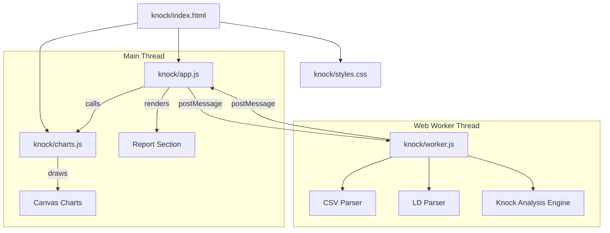

# Design Document: Knock Analyzer

## Overview

The Knock Analyzer is a browser-based diagnostic tool that analyzes per-cylinder knock data from MoTeC M1 ECU logs for the GM LT4 V8 engine with MoTeC M142 ECU. It follows the same architecture as the existing Injector Characterization tool: a Web Worker performs all heavy parsing and analysis computation, while the main thread handles UI rendering and user interaction.

The tool detects knock events using a configurable threshold, correlates them with operating conditions (RPM, load, gear, ignition timing), provides per-cylinder distribution analysis, and generates timing adjustment recommendations.

### Key Design Decisions

1. **Reuse existing parsing infrastructure** — The CSV and .ld parsers from `injector/worker.js` are duplicated into `knock/worker.js` (same pattern as the injector tool, which is self-contained). This avoids cross-tool dependencies and keeps each tool independently loadable via `file://`.

2. **Threshold-driven recomputation** — When the user changes the knock threshold, only the event classification and downstream analysis are recomputed (not re-parsing). The parsed channel data is cached in the worker.

3. **Binning strategy** — RPM bins are 500 RPM wide (0–7500), load bins are 10 kPa wide (0–250). This provides sufficient granularity for tuning decisions without creating sparse heatmaps.

4. **Proportional timing recommendations** — Recommendations are scaled relative to the cylinder with the fewest knock events (which gets zero reduction), capped at 5 degrees maximum.

## Architecture



### Message Protocol (Main Thread ↔ Worker)

**Main → Worker:**
- `{ type: 'analyze', logText: string }` — Parse CSV and run analysis
- `{ type: 'analyze_ld', buffer: ArrayBuffer }` — Parse .ld and run analysis
- `{ type: 'reanalyze', threshold: number }` — Recompute with new threshold (uses cached data)

**Worker → Main:**
- `{ type: 'progress', phase: string, percent: number }` — Progress update
- `{ type: 'warning', message: string }` — Non-fatal warning
- `{ type: 'result', analysis: AnalysisResult, chartData: ChartData }` — Complete results
- `{ type: 'error', message: string }` — Fatal error

## Components and Interfaces

### knock/worker.js — Analysis Worker

Responsible for all computation. Contains:

1. **Parsing Module** (reused from injector pattern):
   - `detectHeaderRow(lines)` → header row index
   - `findDataStart(lines, headerRowIdx)` → first data row index
   - `parseDataRows(lines, dataStart, numCols, progressCb)` → numeric data array
   - `parseLdFile(buffer, progressCb)` → `{ columnNames, data, maxFreq }`
   - Supporting functions: `readChannelData`, `decodeFloat16`, `normalizeLdChannelNameWithUnit`

2. **Channel Resolution**:
   - `CHANNEL_MAP` — Maps logical names to MoTeC column name candidates
   - `resolveChannels(columnNames)` → `{ resolved: {}, warnings: [] }`
   - Knock-specific channels: `knock_cyl_1` through `knock_cyl_8`, `ign_timing`, `ign_timing_comp`, `rpm`, `map`, `tps`, `gear`, `coolant_temp`

3. **Knock Analysis Engine**:
   - `classifyKnockEvents(data, channels, threshold)` → `KnockEvent[]`
   - `computeCylinderDistribution(events)` → `CylinderDistribution`
   - `computeHeatmapBins(events)` → `HeatmapData`
   - `computeTimingCorrelation(events)` → `TimingCorrelation`
   - `computeTimingRetardStats(data, channels, events)` → `RetardStats`
   - `identifyWorstConditions(events)` → `WorstConditions`
   - `computeTimingRecommendations(distribution)` → `TimingRecommendation[]`
   - `generateDiagnostics(distribution, worstConditions, retardStats)` → `string[]`

4. **Utility Functions**:
   - `assignRpmBin(rpm)` → bin index (500 RPM bins, 0–7500)
   - `assignLoadBin(kpa)` → bin index (10 kPa bins, 0–250)
   - `downsampleForChart(data, maxPoints)` → downsampled array
   - `computeMean(values)`, `computeMax(values)`, `computeMedian(values)`

### knock/app.js — UI Controller

Manages:
- File input validation (.csv/.ld extension check)
- Worker lifecycle (create via Blob URL for file:// compatibility, terminate on completion)
- Threshold input handling (validation, debounced reanalysis)
- Progress display (progress bar with phase labels)
- Report rendering (DOM manipulation, no innerHTML with user data)
- Chart section visibility

### knock/charts.js — Canvas Chart Renderer

Provides chart rendering functions using the same utility pattern as `injector/charts.js`:
- `setupCanvas(canvas)` — DPI-aware canvas setup
- `computePlotArea(width, height, margins)` — Plot area bounds
- `drawAxes(ctx, plotArea, xLabel, yLabel)` — Axis lines and labels
- `drawGridlines(ctx, plotArea, xTicks, yTicks)` — Light gridlines
- `computeNiceRange(min, max, targetTicks)` — Nice axis range computation
- `mapToPlot(value, min, max, plotMin, plotMax)` — Data-to-pixel mapping
- `drawLegend(ctx, plotArea, items)` — Legend rendering

Chart-specific renderers:
- `renderCylinderBarChart(canvas, distribution)` — Per-cylinder knock count bars
- `renderKnockVsRpmScatter(canvas, events)` — Knock level vs RPM scatter
- `renderKnockHeatmap(canvas, heatmapData)` — RPM × Load heatmap
- `renderTimingVsRpmScatter(canvas, events)` — Ignition timing vs RPM with knock level color
- `renderTimingRetardTimeSeries(canvas, retardData)` — Timing compensation over time

### knock/index.html — Page Structure

Follows the injector tool's layout:
- Navigation bar with back link
- File input section (file picker + analyze button)
- Threshold configuration input
- Progress section (bar + phase text)
- Report section (channel mapping, warnings, diagnostic summary, cylinder distribution table, timing recommendations table)
- Charts section (5 canvas charts in a grid)

## Data Models

### KnockEvent
```javascript
{
    timestamp: number,       // seconds from log start
    cylinderIndex: number,   // 1–8
    knockLevel: number,      // 0–100 (%)
    rpm: number | null,      // Engine Speed (rpm)
    load: number | null,     // Inlet Manifold Pressure (kPa)
    ignTiming: number | null,       // Ignition Timing (dBTDC)
    ignTimingComp: number | null,   // Timing Compensation (dBTDC)
    tps: number | null,      // Throttle Position (%)
    gear: number | null      // Gear number
}
```

### CylinderDistribution
```javascript
{
    counts: number[8],       // knock event count per cylinder (index 0 = cyl 1)
    percentages: number[8],  // percentage per cylinder, rounded to 1 decimal
    total: number,           // sum of all counts
    ranking: number[]        // cylinder indices sorted by count desc, index asc tie-break
}
```

### HeatmapData
```javascript
{
    rpmBins: number[],       // bin boundaries [0, 500, 1000, ..., 7500]
    loadBins: number[],      // bin boundaries [0, 10, 20, ..., 250]
    counts: number[][]       // 2D array [rpmBinIdx][loadBinIdx] = event count
}
```

### TimingCorrelation
```javascript
{
    perRpmBin: Array<{ mean: number, max: number, count: number }>,
    perCylinder: Array<{ mean: number, max: number, count: number }>
}
```

### RetardStats
```javascript
{
    nonZeroCount: number,    // samples where timing comp != 0
    maxRetard: number,       // maximum timing compensation value
    meanDuringKnock: number, // mean timing comp during knock events
    timeSeries: { time: number[], values: number[] }  // for chart rendering
}
```

### TimingRecommendation
```javascript
{
    cylinderIndex: number,   // 1–8
    reductionDeg: number     // recommended timing reduction (0 to 5 degrees)
}
```

### AnalysisResult
```javascript
{
    channelMapping: Object,          // logical name → boolean (found)
    channelWarnings: string[],       // missing channel warnings
    cylinderDistribution: CylinderDistribution,
    heatmapData: HeatmapData,
    timingCorrelation: TimingCorrelation,
    retardStats: RetardStats | null,
    worstConditions: WorstConditions,
    timingRecommendations: TimingRecommendation[],
    diagnostics: string[],
    threshold: number
}
```

### ChartData
```javascript
{
    knockEvents: KnockEvent[],       // all classified events
    cylinderDistribution: CylinderDistribution,
    heatmapData: HeatmapData,
    retardTimeSeries: { time: number[], values: number[] } | null,
    timingCorrelation: TimingCorrelation
}
```

## Correctness Properties

*A property is a characteristic or behavior that should hold true across all valid executions of a system — essentially, a formal statement about what the system should do. Properties serve as the bridge between human-readable specifications and machine-verifiable correctness guarantees.*

### Property 1: Knock event classification correctness

*For any* knock level value and any threshold value (both in range 0–100%), the classification function SHALL return true (knock event) if and only if the knock level is strictly greater than the threshold.

**Validates: Requirements 2.2**

### Property 2: Knock event data association integrity

*For any* parsed log data row that is classified as a knock event, the resulting KnockEvent record SHALL contain the exact values from that row for all available channels (timestamp, RPM, load, timing, etc.), and SHALL mark unavailable channels as null rather than omitting the event.

**Validates: Requirements 2.4, 2.6**

### Property 3: Per-cylinder distribution invariants

*For any* set of knock events distributed across cylinders 1–8: (a) the sum of per-cylinder counts SHALL equal the total knock event count, (b) each cylinder's percentage SHALL equal `(count / total * 100)` rounded to 1 decimal place, and (c) the ranking SHALL be sorted in descending order by count with ascending cylinder index as tie-breaker.

**Validates: Requirements 3.1, 3.2, 3.4**

### Property 4: Bin assignment correctness

*For any* RPM value in [0, 7500], it SHALL be assigned to exactly one bin of 500 RPM width. *For any* load value in [0, 250] kPa, it SHALL be assigned to exactly one bin of 10 kPa width. The bin index SHALL equal `floor(value / binWidth)` clamped to the valid range.

**Validates: Requirements 4.3, 4.4**

### Property 5: Statistical aggregation correctness

*For any* non-empty group of knock events (grouped by RPM bin or by cylinder), the computed mean timing SHALL equal the arithmetic mean of the timing values in that group, and the computed max timing SHALL equal the maximum timing value in that group.

**Validates: Requirements 5.2, 5.3**

### Property 6: Timing retard statistics correctness

*For any* array of timing compensation values: (a) the non-zero count SHALL equal the number of elements that are not equal to zero, (b) the maximum SHALL equal the actual maximum of the array, and (c) for any subset of indices corresponding to knock events, the mean SHALL equal the arithmetic mean of the values at those indices.

**Validates: Requirements 6.2, 6.3, 6.4**

### Property 7: Maximum-count bin identification

*For any* distribution of knock events across bins (RPM bins, load bins, or gears), the identified "worst" bin SHALL be the one with the highest count. When multiple bins share the maximum count, the lowest-indexed bin SHALL be selected.

**Validates: Requirements 7.1, 7.2, 7.3**

### Property 8: Timing recommendation proportionality and cap

*For any* per-cylinder knock event distribution where total events > 0: (a) the cylinder with the fewest events SHALL receive a recommendation of 0 degrees, (b) all other cylinders SHALL receive a reduction proportional to `(count - minCount) / (maxCount - minCount)`, (c) no recommendation SHALL exceed 5 degrees, and (d) the cylinder with the most events SHALL receive the largest reduction.

**Validates: Requirements 9.1, 9.2, 9.3**

### Property 9: Downsampling preserves statistical distribution

*For any* dataset exceeding 150,000 points, the downsampled output SHALL have fewer points than the input AND the downsampled data SHALL preserve the minimum, maximum, and mean of the original data within a tolerance of 1%.

**Validates: Requirements 10.5**

### Property 10: Missing channel warning correctness

*For any* subset of the 8 knock level channels present in a log file, the warning list SHALL contain exactly the channel names that are NOT present, and SHALL contain no channel names that ARE present.

**Validates: Requirements 1.4**

## Error Handling

### Parsing Errors
- **Empty file (0 bytes)**: Worker posts `{ type: 'error', message: 'File contains no data' }`. App displays error banner.
- **No "Time" header found**: Worker posts error with message indicating header row not found within first 25 lines.
- **Invalid .ld structure**: Worker posts error with specific failure (no channel metadata, zero channels, etc.).
- **Malformed data rows**: Individual NaN values are tolerated (stored as NaN in the data array). Rows that are entirely empty are skipped.

### Channel Resolution Errors
- **No knock channels found**: Worker posts a warning listing all 8 expected channel names. Analysis proceeds with zero knock events.
- **Partial knock channels**: Analysis proceeds with available cylinders. Missing cylinders are excluded from distribution (not counted as zero).
- **Missing optional channels** (gear, timing comp, etc.): Analysis proceeds. Affected sections display "data not available" messages. KnockEvent fields are set to null.

### Threshold Validation
- **Out of range (< 0 or > 100)**: App rejects input, reverts to previous valid value, shows inline error.
- **Non-numeric input**: App rejects input, reverts to previous valid value, shows inline error.
- **Boundary values (0 and 100)**: Accepted as valid. Threshold of 0 means all non-zero knock levels are events. Threshold of 100 means no events are possible.

### Worker Errors
- **Unexpected worker crash**: App catches `worker.onerror`, displays generic error banner, re-enables analyze button.
- **Worker timeout**: Not explicitly enforced (analysis should complete within seconds for typical log sizes).

## Testing Strategy

### Property-Based Tests (fast-check)

The project uses `fast-check` for property-based testing (as seen in `tests/test-properties.js`). Each correctness property maps to a property-based test with minimum 100 iterations.

**Test file**: `tests/test-knock-properties.js`

Properties to implement:
1. **Feature: knock-analyzer, Property 1: Knock event classification correctness** — Generate random (knockLevel, threshold) pairs, verify classification.
2. **Feature: knock-analyzer, Property 2: Knock event data association integrity** — Generate random log rows, classify events, verify field values match source.
3. **Feature: knock-analyzer, Property 3: Per-cylinder distribution invariants** — Generate random event arrays, verify count conservation, percentage computation, and ranking order.
4. **Feature: knock-analyzer, Property 4: Bin assignment correctness** — Generate random RPM/load values, verify bin assignment.
5. **Feature: knock-analyzer, Property 5: Statistical aggregation correctness** — Generate random grouped timing values, verify mean/max.
6. **Feature: knock-analyzer, Property 6: Timing retard statistics correctness** — Generate random timing comp arrays and event indices, verify stats.
7. **Feature: knock-analyzer, Property 7: Maximum-count bin identification** — Generate random count distributions, verify max identification.
8. **Feature: knock-analyzer, Property 8: Timing recommendation proportionality and cap** — Generate random per-cylinder counts, verify proportional scaling and 5° cap.
9. **Feature: knock-analyzer, Property 9: Downsampling preserves statistical distribution** — Generate large random arrays, verify min/max/mean preservation.
10. **Feature: knock-analyzer, Property 10: Missing channel warning correctness** — Generate random channel subsets, verify warning list.

### Unit Tests (Example-Based)

**Test file**: `tests/test-knock-analysis.js`

- CSV parsing with knock channel headers at various positions
- .ld file parsing with knock channels
- Threshold edge cases (0%, 100%, boundary values)
- Zero knock events scenario (all sections handle gracefully)
- Single cylinder with all events
- All cylinders with equal events (tie-breaking)
- Missing gear channel (gear analysis omitted)
- Missing timing compensation channel (retard section shows unavailable message)
- Diagnostic message content verification

### Integration Tests

- Full end-to-end: load a real MoTeC CSV with known knock events, verify analysis output matches expected values.
- Worker message protocol: verify correct message sequence (progress → result or error).
- Threshold change reanalysis: verify cached data is reused and results update correctly.

### Visual/Manual Tests

- Chart rendering with dark theme
- Heatmap color intensity scaling
- Progress bar animation during parsing
- Responsive layout at different viewport sizes
