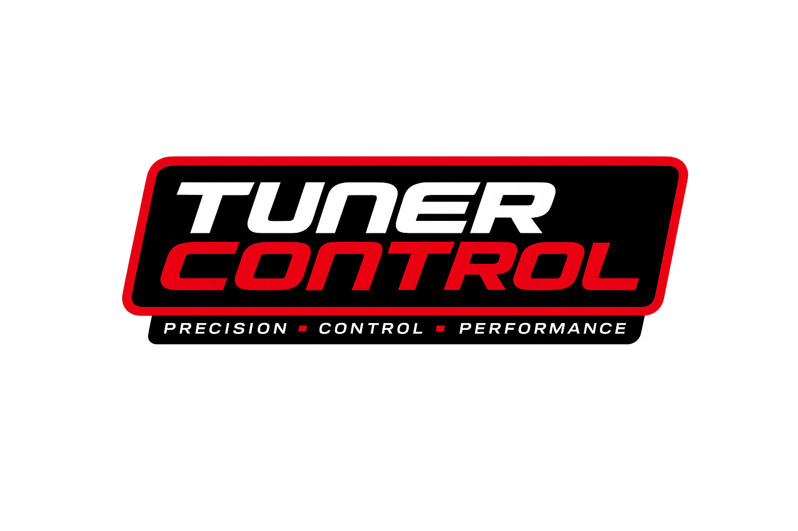

# TunerControl

<p align="center">
  
</p>

A zero-dependency, browser-based toolkit for MoTeC M1 ECU tuning and analysis. No installation, no build step, no backend server required — just open in a browser and go.

---

## Tools

### VE Table Tuning
Analyze MoTeC log data against your current VE table to compute per-cell correction percentages. Produces downloadable CSVs ready to import back into MoTeC M1 Tune.

**Features:**
- Accepts CSV log exports or raw `.ld` binary log files
- Configurable filters: min hit count, coolant temperature, run time, TPS rate of change
- Outlier filtering (configurable σ threshold) with two-pass statistical analysis
- Partial apply scaling factor for conservative iterative tuning
- Minimum change amount to ignore noise
- Gaussian spatial smoothing for correction maps
- Standard deviation display for data quality assessment
- 4 display views: Correction %, New VE Values, Hit Counts, Std Dev
- Interactive 3D surface plot with drag rotation and zoom
- Copy to clipboard (pastes directly into MoTeC M1 Tune tables)
- Comprehensive help documentation

### Injector Characterization
Lean spike analysis, injector pulsewidth stability, DI fuel pressure tracking, injection timing, and closed-loop fuel trim diagnostics.

### Knock Analyzer
Per-cylinder knock event detection, operating condition correlation, and timing adjustment recommendations from MoTeC log data.

### Idle Behavior Analyzer
Deceleration idle hang detection, settle time analysis, and mass flow correlation from MoTeC log data.

### DI Fuel Pressure Deep Dive
Rail pressure vs aim analysis, overshoot/undershoot detection, and operating condition correlation for direct injection fuel system diagnostics.

### Calculators
Quick bidirectional unit conversions for tuning:
- kPa ↔ PSI ↔ Bar (gauge and absolute with 102 kPa atmospheric reference)
- °C ↔ °F
- AFR ↔ Lambda (gasoline)
- km/h ↔ mph
- Lambda Fuel Conversion chart (gasoline and E85 with common tuning targets)

---

## Getting Started

1. Clone or download this repository.
2. Serve the files over HTTP/HTTPS (recommended) or open `index.html` directly in a browser.

```bash
# Quick local server (Python 3)
python3 -m http.server 8080
# then open http://localhost:8080
```

3. Click any tool card on the landing page to get started.

> **Note:** The tools use Web Workers for heavy computation. Some browsers restrict
> Web Workers on `file://` URLs. If a tool doesn't respond after clicking Process,
> use a local HTTP server as shown above.

---

## Project Structure

```
index.html                  — Landing page with tool navigation
TunerControlLogo.png        — Project logo

ve-table/                   — VE Table Tuning Tool
  index.html                — Tool UI
  app.js                    — Main thread: UI, Worker lifecycle, rendering, 3D plot
  worker.js                 — Worker thread: parsing, filtering, correction, output
  styles.css                — Dark theme styling
  help.html                 — Comprehensive documentation and usage guide

injector/                   — Injector Characterization Tool
  index.html, app.js, charts.js, worker.js, styles.css

knock/                      — Knock Analyzer
  index.html, app.js, charts.js, worker.js, styles.css

idle/                       — Idle Behavior Analyzer
  index.html, app.js, charts.js, worker.js, styles.css

fuel-pressure/              — DI Fuel Pressure Deep Dive
  index.html, app.js, charts.js, worker.js, styles.css

calculators/                — Unit Conversion Calculators
  index.html                — Main calculators page
  lambda-fuel.html          — Lambda/AFR fuel conversion chart (gasoline & E85)

lib/                        — Vendored libraries (Chart.js, zoom plugin, Hammer.js)

tests/                      — Browser-based test suite
  index.html                — Test harness (no build step required)
  test-*.js                 — Unit and property-based tests

analysis/                   — Reference data and analysis scripts (not part of the app)
files/                      — Sample log and VE table files for testing
```

---

## Running Tests

1. Serve the project over HTTP (see Getting Started above).
2. Open `http://localhost:8080/tests/index.html` in a browser.
3. The test harness runs all unit and property-based tests and displays a pass/fail summary.

---

## Technology

- Pure HTML/CSS/JavaScript — no frameworks, no build tools, no npm
- Web Workers for non-blocking computation on large log files
- Chart.js for 2D charting (vendored in `lib/`)
- Canvas API for 3D surface visualization
- Runs entirely client-side — no data leaves your browser

---

## License

See [LICENSE](LICENSE) for details.
